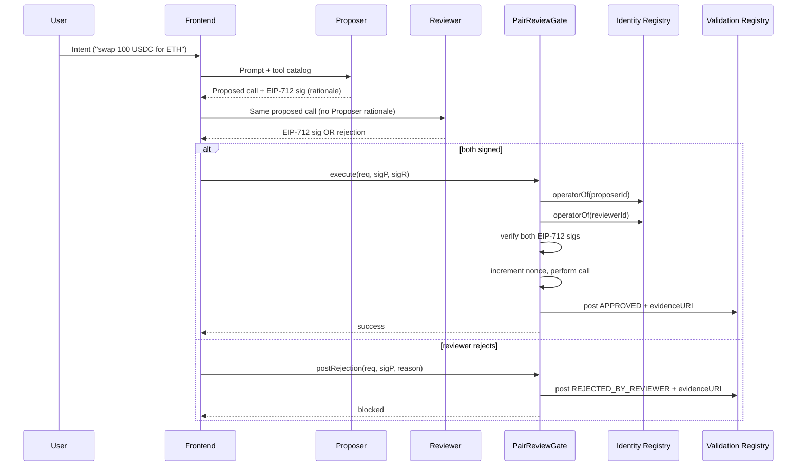

# PairReviewGate — Architecture

> A 2-of-2 agent safety gate built on **ERC-8004**. Two independently-registered agents (a **Proposer** and a **Reviewer**) must both sign an EIP-712 typed payload before an on-chain action executes. Designed to resist prompt-injection and unilateral-agent compromise.

This document describes the system as built for ETHGlobal **Open Agents** (2026-04-24 → 2026-05-06). It is intentionally narrow: one security primitive, done well, on top of a standard judges already recognize.

---

## 1. Design goals & non-goals

**Goals**

- Make a single agent's compromise insufficient to execute an action.
- Use only public, recognizable standards on the critical path: **ERC-8004** (Identity + Validation registries) and **EIP-712** (readable typed signing).
- Keep the on-chain surface small, auditable, and gas-reasonable.
- Produce a public, immutable trail of pair-review decisions usable as reputation signal.

**Non-goals (deliberately deferred)**

- We do **not** implement ERC-8126 (Draft, narrow verification scope). Its risk-scoring concept is referenced as future work in §10.
- We do **not** implement ERC-7857 / iNFT private metadata. The "only hashes / sealed keys on-chain" principle informs our storage discipline, but private-policy distribution is out of scope for the hackathon.
- We do **not** introduce a generic audit-log contract or Merkle root layer. ERC-8004's Validation Registry already gives us per-decision attestation; an additional audit layer adds surface area without adding demo value.

---

## 2. System overview

```mermaid
flowchart LR
    U[User / Owner] -->|EIP-712 request| FE[Frontend dApp]
    FE --> P[Proposer Agent]
    FE --> R[Reviewer Agent]
    P -->|sign typed data| FE
    R -->|sign typed data| FE
    FE -->|execute(req, sigP, sigR)| GATE[PairReviewGate.sol]
    GATE -->|resolve agentId -> operator| ID[ERC-8004 Identity Registry]
    GATE -->|on success/failure| VAL[ERC-8004 Validation Registry]
    P -.metadata.-> IPFS[(IPFS agent card)]
    R -.metadata.-> IPFS
    VAL -.evidenceURI.-> IPFS
```

The frontend orchestrates a request, asks both agents to sign the same EIP-712 payload independently (no shared context, no shared prompt), and submits both signatures to the gate contract. The gate resolves agent IDs to current operator addresses via the Identity Registry, verifies both signatures, executes the wrapped call, and posts the outcome to the Validation Registry.

---

## 3. ERC-8004 integration

ERC-8004 went live on Ethereum mainnet on 2026-01-29 and is deployed across 20+ networks. We use two of its three registries.

### 3.1 Identity Registry — agents as portable identities

Each agent (Proposer, Reviewer) is registered as an ERC-8004 NFT. The PairReviewGate contract stores **`agentId`** values, not raw addresses. At execution time it resolves the current operator address from the registry.

This gives us three properties for free:

1. **Portability.** The owner can rotate the operator address (key compromise, infrastructure migration) without redeploying the gate.
2. **Public discoverability.** Both agents are visible on `8004scan.io` with their agent cards.
3. **Verifiable independence.** "Two distinct agents from two distinct registrations" becomes a check anyone can perform on-chain.

### 3.2 Validation Registry — outcome attestation

Every `execute()` call posts a validation response to the Validation Registry, regardless of whether the request was approved or rejected by the pair. The response payload includes:

- Outcome: `APPROVED` / `REJECTED_BY_PROPOSER` / `REJECTED_BY_REVIEWER` / `DISAGREEMENT`.
- Request hash (the EIP-712 digest the agents signed over).
- Evidence URI (IPFS pointer to the request body, both agents' rationale, and any tool-call traces).
- Score: 100 on approve, 0 on reject — kept simple, single dimension.

> **Note on Validation Registry stability.** The Validation Registry is described in 8004 docs as "under active revision with the TEE community." Before deployment, verify which version is canonical on the target network via `8004scan.io`. The interface in §5.3 wraps this so the resolver can be swapped behind it.

### 3.3 Why not the Reputation Registry

Reputation Registry submissions are typically client-attributed feedback. PairReviewGate produces *protocol-level* outcomes, not user feedback, so Validation Registry is the correct attachment point. Aggregated reputation can later be derived off-chain from Validation entries.

---

## 4. Request lifecycle



**Critical isolation rule.** The Reviewer never sees the Proposer's rationale, internal chain-of-thought, or any free-form text the Proposer wrote. It only sees the structured action being requested. This is what makes prompt injection harder to land on both agents simultaneously — the injection vector available to the Proposer is not the same surface available to the Reviewer.

---

## 5. Smart contracts

### 5.1 EIP-712 typed structure

```solidity
// EIP-712 domain: name="PairReviewGate", version="1", chainId, verifyingContract
struct AgentRequest {
    uint256 proposerId;     // ERC-8004 token id
    uint256 reviewerId;     // ERC-8004 token id
    address target;         // contract being called
    uint256 value;          // wei
    bytes   data;           // calldata
    uint256 nonce;          // per-pair nonce
    uint256 deadline;       // unix seconds
    bytes32 contextHash;    // keccak256 of agent inputs (intent, tool catalog snapshot)
}
```

`contextHash` lets us bind a signature to a specific request context without putting that context on-chain. The same `contextHash` MUST appear in both signatures.

### 5.2 PairReviewGate (core)

```solidity
interface IPairReviewGate {
    event Executed(
        uint256 indexed proposerId,
        uint256 indexed reviewerId,
        bytes32 indexed requestHash,
        address target,
        uint256 value,
        bytes returnData
    );

    event Rejected(
        uint256 indexed proposerId,
        uint256 indexed reviewerId,
        bytes32 indexed requestHash,
        uint8   reasonCode
    );

    function execute(
        AgentRequest calldata req,
        bytes calldata proposerSig,
        bytes calldata reviewerSig
    ) external payable returns (bytes memory);

    function postRejection(
        AgentRequest calldata req,
        bytes calldata proposerSig,    // optional; zero-length if no proposer sig
        uint8 reasonCode,
        string calldata evidenceURI
    ) external;

    function nonceOf(uint256 proposerId, uint256 reviewerId) external view returns (uint256);
}
```

### 5.3 Validation registry adapter

The gate writes to ERC-8004's Validation Registry through a thin adapter so the registry version can be swapped without touching gate logic.

```solidity
interface IValidationAdapter {
    function postValidation(
        uint256 subjectAgentId,    // typically proposerId
        uint8   score,             // 0..100
        bytes32 requestHash,
        string calldata evidenceURI,
        bytes32 evidenceHash,
        bytes32 tag                // e.g. keccak256("PairReviewGate.v1")
    ) external returns (bytes32 validationId);
}
```

### 5.4 Signature verification

We use OpenZeppelin's `SignatureChecker.isValidSignatureNow` for both signatures. It transparently handles EOAs and ERC-1271 contract wallets, so an agent backed by a smart account (4337 / passkeys / multisig) works without code changes on the gate side.

---

## 6. Off-chain components

### 6.1 Proposer agent

- **Inputs:** user intent, tool catalog, current state snapshot.
- **Output:** structured `AgentRequest` + free-form rationale (logged for evidence URI but **never** forwarded to Reviewer).
- **Signing:** EIP-712 typed data over the request struct. The agent's operator key (or 1271 wallet) signs.

### 6.2 Reviewer agent

- **Inputs:** the structured `AgentRequest` only. **No rationale, no Proposer transcript, no shared scratchpad.**
- **Decision policy:** "Would I, looking at this action in isolation, sign this?" Configurable rule set: max value, allowed targets, tool allowlist, sanity checks against on-chain state.
- **Output:** sig OR a rejection with `reasonCode` + short evidence note.

### 6.3 Frontend orchestrator

- Constructs the EIP-712 payload, computes `contextHash`, fans out to both agents, collects sigs, submits to gate.
- Pins evidence bundle (request body, both rationales, tool-call traces) to IPFS before submitting; passes the resulting CID as `evidenceURI`.

### 6.4 Indexer (optional, demo-only)

- Subscribes to `Executed` / `Rejected` events and Validation Registry writes.
- Powers the demo dashboard ("agent pair X has handled N requests, blocked M attacks").

---

## 7. Storage discipline

We borrow one principle from ERC-7857: **only hashes and integrity-critical state belong on-chain.**

| Layer | On-chain | Off-chain (IPFS) |
|---|---|---|
| Agent identity | `agentId`, owner, operator (resolved via 8004) | Agent card JSON: name, description, capabilities, endpoints |
| Request | `requestHash`, `contextHash`, nonce, deadline | Full request body, tool catalog snapshot |
| Decision | `Executed` / `Rejected` event, validation entry | Both rationales, tool-call traces, sanity-check outputs |
| Evidence | `evidenceHash` | Evidence bundle (IPFS CID — content-addressed by construction) |

Evidence integrity is verified on read: fetch from `evidenceURI`, hash, compare against `evidenceHash` posted on-chain. Mismatch → mark the validation entry as **unverifiable** in the UI rather than trusting it blindly.

---

## 8. Security considerations

### 8.1 Threat model

| Adversary | Attack | Mitigation |
|---|---|---|
| Compromised Proposer | Inject malicious calldata via prompt injection | Reviewer is isolated; signs only the structured request |
| Compromised Reviewer | Sign a malicious request to please attacker | Rejection is the safe default; both must sign affirmative |
| Both agents compromised | Coordinated jailbreak | Out of scope — this is the trust assumption of 2-of-2 |
| Operator key theft | Sign as the agent | Owner rotates operator address via ERC-8004; old sigs become invalid by `nonceOf` and `contextHash` divergence |
| Replay (same request) | Submit a previously-valid sig pair | `nonce` per agent pair + `deadline` |
| Replay (different gate) | Submit sigs to a forked gate | EIP-712 domain separator (`chainId`, `verifyingContract`) |
| Storage tampering | Replace evidence on IPFS | `evidenceHash` posted on-chain; UI marks mismatched evidence as unverifiable |
| Signature scheme confusion | EOA agent flips to contract wallet | `SignatureChecker` handles both; nonce continuity preserved |
| Unbound endpoint drift | Agent card swaps web endpoint after registration | Off-chain monitor — flag domain drift; out of gate's enforcement scope |

### 8.2 Replay protection in detail

A request is bound to a single execution by four overlapping invariants:

1. **Per-pair nonce** monotonically increases. The signed payload includes the current nonce; replays fail signature verification after the first execution.
2. **Deadline** caps how long a sig pair is valid even if never submitted.
3. **Domain separator** binds sigs to this contract on this chain.
4. **`contextHash`** binds sigs to the specific upstream context. Even if an attacker captured both sigs, swapping in a different request body would break `contextHash` agreement.

### 8.3 Signature verification rules

- Both sigs MUST validate via `SignatureChecker.isValidSignatureNow` against the operator addresses returned by `IIdentityRegistry.operatorOf(agentId)` *at the time of execution*, not at the time of signing. This is intentional: a recently-rotated operator key invalidates in-flight sigs.
- `proposerId != reviewerId` is enforced. A pair cannot be the same agent twice.
- `req.proposerId != 0` and `req.reviewerId != 0` — the zero token ID is rejected.

### 8.4 Out-of-scope risks (documented for honesty)

- **Side-channel coordination.** If Proposer and Reviewer share infrastructure, network position, or LLM provider, an attacker controlling that shared layer can attack both. The protocol assumes infrastructure separation; the demo enforces it via different LLM providers.
- **Provenance of the request.** PairReviewGate validates the *action*, not the *intent that led to it*. If the user is socially engineered into asking for the malicious action, the gate cannot help.
- **Long-tail Validation Registry semantics.** As noted in §3.2, the Validation Registry is in active revision; we wrap it behind an adapter to allow upgrade.

---

## 9. Deployment

**Target:** Base Sepolia for the hackathon. Reasoning: mature wallet/tooling support, ERC-8004 deployments confirmed, low-friction faucet.

**Pre-flight checklist:**

- [ ] Verify canonical ERC-8004 Identity Registry address on Base Sepolia via `8004scan.io`.
- [ ] Verify Validation Registry version on Base Sepolia; pin adapter to that version.
- [ ] Mint Proposer and Reviewer agent NFTs with agent cards on IPFS.
- [ ] Set EIP-712 domain (`name="PairReviewGate"`, `version="1"`, fixed `chainId`).
- [ ] Smoke-test: EOA Proposer + EOA Reviewer happy path.
- [ ] Smoke-test: ERC-1271 Reviewer (smart account) happy path.
- [ ] Smoke-test: replay rejection (same nonce twice).
- [ ] Smoke-test: deadline expiry.
- [ ] Smoke-test: operator rotation invalidates in-flight sig.
- [ ] Smoke-test: prompt-injection attack blocked end-to-end and posted to Validation Registry.

**Approximate gas (rough order-of-magnitude only, not measured):**

| Operation | Estimate |
|---|---:|
| `execute` (happy path, simple inner call) | 180k–280k |
| `postRejection` | 90k–140k |
| Validation Registry write | varies by version |

---

## 10. Future work

These are intentionally out of scope for the hackathon submission, but documented so the design's growth path is clear.

- **ERC-8126 risk-score pre-check.** Before accepting a Reviewer's signature, fetch its current risk score from a registered ERC-8126 provider; reject below a threshold. Adds a third pre-condition but ties cleanly into Validation Registry as the score backing.
- **ERC-7857 private policy.** A Reviewer's decision rules (allowlists, value caps, target-specific policies) are sensitive. ERC-7857-style sealed metadata would let owners distribute updated policies to the Reviewer's runtime without leaking them on-chain. Today we keep policies in-process.
- **Multi-quorum (m-of-n).** Generalize from 2-of-2 to k-of-n with weighted voting per agent specialization (e.g., a "DeFi-domain agent" gets weight on swaps, an "ENS-domain agent" gets weight on name operations).
- **TEE-attested operator keys.** Bind operator addresses to TEE attestations so a stolen key without the corresponding TEE is unusable. Aligns with the direction the Validation Registry is reportedly heading.
- **Cross-pair reputation.** Off-chain aggregation of Validation Registry entries to surface "this Reviewer has caught N prompt-injection attempts across M pairings" as a public signal.

---

## 11. Standards & references

- **ERC-8004** — Trustless Agents (Identity, Reputation, Validation registries). Mainnet 2026-01-29.
- **EIP-712** — Typed structured data hashing and signing.
- **ERC-1271** — Standard signature validation method for contracts.
- **EIP-4361 (SIWE)** — Sign-In With Ethereum, used for frontend session.
- **OpenZeppelin Contracts** — `EIP712`, `SignatureChecker`, `ERC721` base implementations.
- **ERC-8126** — Draft AI Agent Verification standard. Referenced as future work, not implemented.
- **ERC-7857** — iNFT / private metadata standard. Referenced as future work, not implemented.
