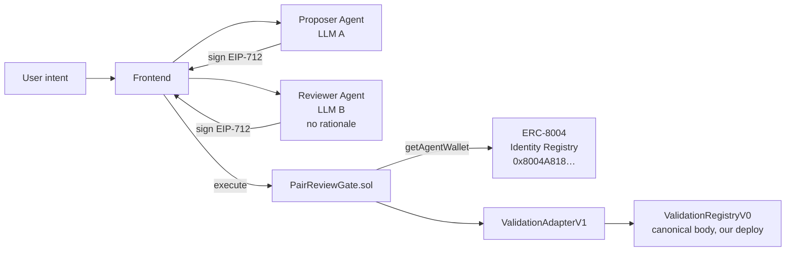
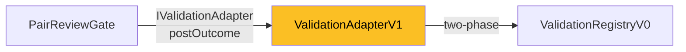

# PairReviewGate

2-of-2 agent safety on **ERC-8004**

<div class="text-sm opacity-60 mt-8">
ETHGlobal Open Agents · 2026
</div>

<!--
[00:00-00:10] Cold open. Pause one beat after the title lands.
"Single agents that sign your transactions are single points of failure.
 One prompt injection, one stolen key — full compromise."
-->

---
layout: center
---

# A single agent that signs is a single point of failure

<div class="grid grid-cols-3 gap-4 mt-12 text-sm">

<div class="p-4 border border-red-400 rounded">
<div class="text-red-400 font-bold">Prompt injection</div>
<div class="opacity-60 mt-2">malicious tool description coerces the agent</div>
</div>

<div class="p-4 border border-red-400 rounded">
<div class="text-red-400 font-bold">Key compromise</div>
<div class="opacity-60 mt-2">leaked operator key, supply-chain attack</div>
</div>

<div class="p-4 border border-red-400 rounded">
<div class="text-red-400 font-bold">Jailbreak</div>
<div class="opacity-60 mt-2">model goes off-policy mid-task</div>
</div>

</div>

<div class="text-center mt-12 text-2xl">
Any one of these = <span class="text-red-400 font-bold">total compromise</span>
</div>

<!--
[00:10-00:25 part A] Frame the threat in three concrete failure modes.
"Three failure modes, one outcome: one signature, full authority."
-->

---
layout: center
---

# The fix in one sentence

<div class="text-2xl mt-8 leading-relaxed">
Two <span class="text-blue-400 font-bold">independently-registered ERC-8004 agents</span><br>
on <span class="text-green-400 font-bold">different LLM providers</span><br>
both sign the same EIP-712 payload<br>
before <span class="text-yellow-400 font-bold">anything</span> executes.
</div>

<!--
[00:10-00:25 part B]
"PairReviewGate splits authority. Two independently-registered ERC-8004
 agents on different LLMs both sign the same typed payload. One
 signature alone never executes."
-->

---

# Architecture



<div class="text-sm opacity-60 mt-4">
Reviewer never sees the Proposer's reasoning — only the structured request.
</div>

<!--
[00:25-00:40]
"Both agents sign the same EIP-712 payload. The gate verifies both
 signatures, resolves agent wallets at execution time from the canonical
 ERC-8004 Identity Registry, and posts the outcome to the Validation
 Registry. The Reviewer runs on a different LLM provider with no access
 to the Proposer's reasoning."
-->

---

# Live on Base Sepolia

<div class="font-mono text-sm mt-8">

| Contract | Address |
|---|---|
| **PairReviewGate** | `0xa0abceded6492946a85daae5a30b096bb1660650` |
| ValidationAdapterV1 | `0xddf516420e5181009a2a39b8db2f768124f414e2` |
| ValidationRegistryV0 | `0x96e4f17bc77584562303e55d6f1270b668504e73` |
| canonical 8004 Identity | `0x8004A818BFB912233c491871b3d84c89A494BD9e` |

</div>

<div class="mt-6 text-blue-400">
sepolia.basescan.org/address/0xa0abceded6492946a85daae5a30b096bb1660650#code
</div>

<div class="text-xs opacity-60 mt-2">
Source verified via Etherscan V2 — judges can read every line.
</div>

<!--
[00:25-00:40 — second half]
"Deployed and verified on Base Sepolia today. The gate, the adapter,
 and our deploy of the canonical Validation Registry source — all three
 verified on Basescan. Source is open."
-->

---

# The non-negotiable security property

```solidity {all|6|all}
function execute(...) external payable nonReentrant returns (bytes memory) {
    // ...invariants, nonce, deadline, msg.value...

    bytes32 digest = _hashTypedDataV4(_structHash(req));

    address proposerWallet = identity.getAgentWallet(req.proposerId);
    //                              ^^^^^^^^^^^^^^^
    //  Resolved at execute() time. NEVER cached.
    //  Wallet rotation between sign and execute → InvalidProposerSig.

    if (!SignatureChecker.isValidSignatureNow(proposerWallet, digest, proposerSig))
        revert InvalidProposerSig();
    // ...same for reviewer, then bump nonce, then call target...
}
```

<div class="mt-4 text-sm opacity-80">
A stolen key has at most one block to land before rotation kills it.
</div>

<!--
[00:40-00:55 part A]
"The gate resolves agent wallets at execute time, never caches them.
 If an agent's owner rotates the wallet between sign and execute —
 say, after detecting a compromise — every in-flight signature
 instantly becomes invalid."
-->

---

# Adapter pattern: registry version is swappable



<div class="mt-6 text-sm">

The ERC-8004 Validation Registry spec is **still under active revision**.
The gate talks to it through `IValidationAdapter`. When the canonical
registry ships its final shape, we swap one address — the **gate stays untouched**.

CLAUDE.md Rule 7. The gate never imports the registry interface directly.

</div>

<!--
[00:40-00:55 part B]
"The Validation Registry is still under spec revision, so the gate
 talks through an adapter. When the canonical registry ships, we swap
 one address — the gate stays untouched. The audit surface doesn't
 change."
-->

---

# Tests aren't optional

<div class="grid grid-cols-2 gap-8 mt-6">

<div>

### 38 tests covering

- ✓ EIP-712 cross-reference (TS ↔ contract)
- ✓ replay, expired deadline
- ✓ contextHash binding
- ✓ operator rotation
- ✓ ERC-1271 smart-account reviewer
- ✓ reentrancy attacker
- ✓ same-agent / zero-id
- ✓ rejection pathway
- ✓ ValidationAdapterV1 ↔ canonical body

</div>

<div>

### Coverage on `PairReviewGate.sol`

<div class="font-mono text-sm mt-2 leading-loose">
| metric | % |
| --- | --- |
| Statements | **100** |
| Branches | **100** |
| Functions | **100** |
| Lines | **100** |
</div>

<div class="text-xs opacity-60 mt-4">
A cross-reference test deploys the gate, calls digestOf(req), and
asserts byte-for-byte equality with viem.hashTypedData on the
frontend. Every commit re-runs it. Drift fails loud.
</div>

</div>

</div>

<!--
[00:55-01:25]
"38 tests covering replay protection, deadline, contextHash binding,
 operator rotation, ERC-1271 smart wallets, reentrancy attacker,
 same-agent rejections, and the rejection pathway.
 100% line-and-branch coverage on the gate contract.
 The cross-reference test enforces that the contract digest matches
 the viem digest byte-for-byte. Every commit runs it."
-->

---
layout: two-cols
---

# Compromise the Proposer

<div class="text-red-400 mt-4">

**Attack:** prompt injection in tool description

**Proposer (LLM A) signs:**

```ts
{
  target: "0xATTACKER",
  value: 1_000_000_000,
  data: "0xtransfer(...)",
  contextHash: keccak256("legit-evidence")
}
```

Proposer's signature: ✓ valid

</div>

::right::

# Reviewer refuses

<div class="text-green-400 mt-4">

**Reviewer (LLM B, different provider):**
- receives the **structured request only**
- no Proposer rationale
- runs **policy gate first**:
  - target ∉ allowlist → reject
  - value > cap → reject
  - selector ∉ allowed → reject
- LLM never even sees this request

**Reviewer signature:** ✗ refused

`gate.execute(...)` reverts.
A `Rejected` event lands on Validation Registry with `score=0`.

</div>

<!--
[01:25-01:45]
"Even if an attacker fully owns the Proposer — prompt injection,
 jailbreak, supply-chain — they get one signature. The Reviewer
 runs on a different LLM provider, sees only the structured request,
 and applies a deterministic policy gate before its LLM ever runs.
 The malicious target isn't on the allowlist. The signature never
 happens. The attack is recorded, on chain, with score zero."
-->

---
layout: center
class: text-center
---

# Pair-review reputation, on chain

<div class="text-xl mt-6 opacity-80">

Every approved + every rejected request → ERC-8004 Validation Registry.

</div>

<div class="grid grid-cols-3 gap-4 mt-12 text-sm">

<div class="p-4 border border-blue-400 rounded">
<div class="text-blue-400 font-bold">Public</div>
<div class="opacity-70 mt-2">8004scan.io reads it; future tools compose against it</div>
</div>

<div class="p-4 border border-blue-400 rounded">
<div class="text-blue-400 font-bold">Attributable</div>
<div class="opacity-70 mt-2">indexed by agent pair, not by client feedback</div>
</div>

<div class="p-4 border border-blue-400 rounded">
<div class="text-blue-400 font-bold">Immutable</div>
<div class="opacity-70 mt-2">evidence URI + hash captured per decision</div>
</div>

</div>

<!--
[Optional 5-second beat if you have time.]
"Reputation isn't a side feature. Every decision — approved or rejected —
 lands on the canonical Validation Registry. Other tools compose against it."
-->

---
layout: center
class: text-center
---

# Built on ERC-8004

<div class="text-lg mt-6 opacity-80">

`PairReviewGate.sol` · `ValidationAdapterV1.sol` · `ValidationRegistryV0.sol`

</div>

<div class="mt-12 font-mono text-sm">
github.com/Elsvent/pair-agent
</div>

<div class="mt-4 text-sm opacity-60">
viem-only · MIT · ETHGlobal Open Agents 2026
</div>

<div class="mt-12 text-2xl">
<span class="text-blue-400">Two distinct agents.</span><br>
<span class="text-green-400">One transaction.</span><br>
<span class="text-yellow-400">No single point of failure.</span>
</div>

<!--
[01:45-02:00]
"ERC-8004-native, viem-only, MIT-licensed.
 github dot com slash Elsvent slash pair-agent.
 Built for ETHGlobal Open Agents 2026. Thank you."
-->
